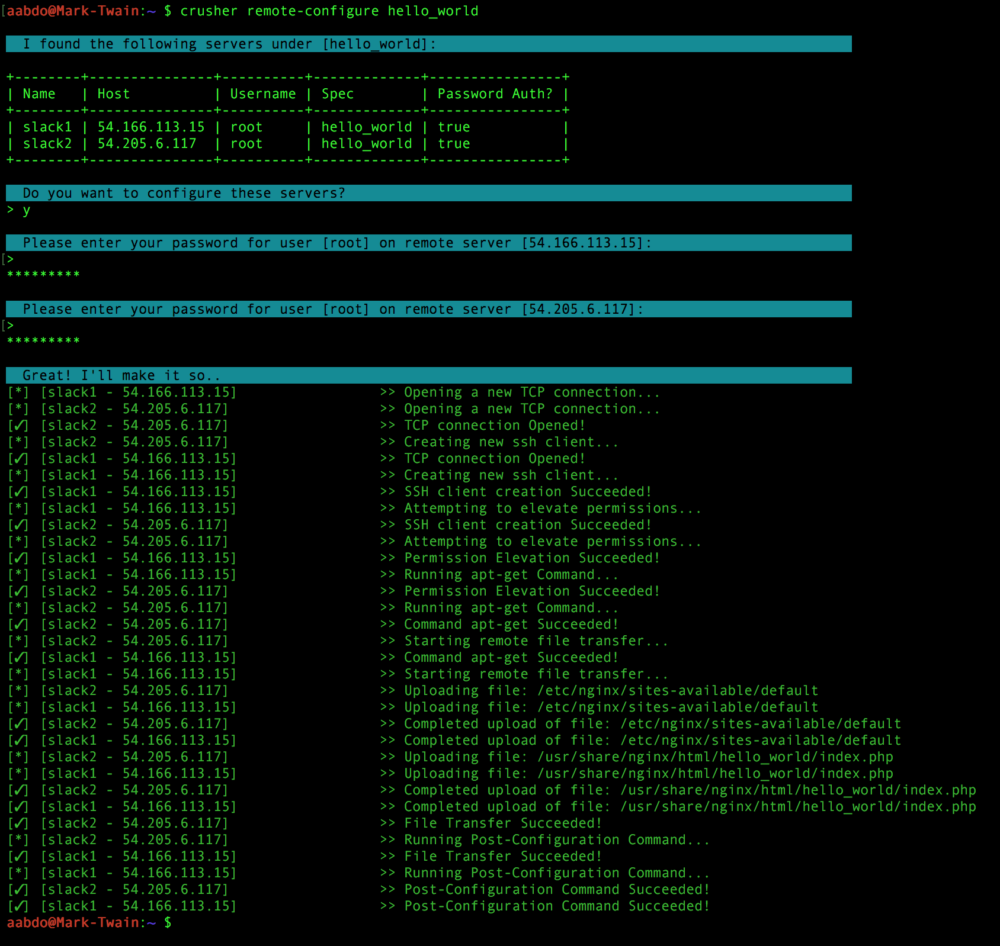

# crusher
> Configuration Management Tool

## Intro
**crusher** is a minimalist configuration-management tool. It aims to provide as much of the flexibility of the available off-the-shelf options, with as little overhead as possible. 

## Requirements
To use this tool, you must at a minimum have the ability to ssh to a host, have permission to write to the temp directory, and run commands with elevated privileges. 

## Use Cases
**crusher** can be used as both a centralized and distributed tool for setting up new servers. 

- Centralized:
**crusher** manages a list of remote servers that it saves in your users home directory (`~/.crusher`). The `remote-configure` command targets remote servers based on name or spec, and runs configuration tasks asynchronously on all of them at the same time.

- Distributed:
compile **crusher** and put it at the base of a git repo containing your spec files. New servers can be launched with a script to check out your repo and run crushers `local-configure` command to configure themselves.

## Installation
1. Install Go (if you haven't already): https://golang.org/doc/install

2. Download and install crusher:

  go get -u github.com/murdinc/crusher
	
3. If `$GOPATH/bin` is not yet in your `$PATH` (check with `echo $PATH`): 

  export PATH="$PATH:$GOPATH/bin"

4. Run it! `crusher --help`

## Commands
The available commands can be printed by running `$ crusher` or `$ crusher --help`:
```
$ crusher --help
crusher - 1.0

Usage:
   crusher [global options] command [command options] [arguments...]

Commands:
   list-servers, l	List all configured remote servers
   remote-configure, rc	Configure one or many remote servers
   local-configure, lc	Configure this local machine with a given spec
   add-server, a	Add a new remote server to the config
   delete-server, d	Delete a remote server from the config
   available-specs, s	List all available specs
   show-spec, ss	Show what a given spec will build
   help, h		Shows a list of commands or help for one command
   
Global Options:
   --version, -v	print the version
   --help, -h		show help
```
Help for specific commands can be printed by passing the `--help` flag to the command
```
$ crusher remote-configure --help
Usage:
   remote-configure search [--flags]

Arguments:
   search	The server or spec group to remote configure

Flags:
   

Example:
   crusher remote-configure hello_world
```

## What's a Spec? 
A `.spec` file (short for specification), along with its `config` and `content` folders, contain the building blocks of a server configutation. Specs contain a list of packages to install, configuration and content files along with their destinations, and commands to run during the configuration job.

Specs can require other specs, to link smaller building blocks into more complex configurations. Check out `hello_word.spec` in the [example-specs](https://github.com/murdinc/crusher/tree/master/example-specs) folder for a simple example. 

By default, **crusher** will look for Specs in the following directories, in order, overwriting previously found specs with the same name: 

1. $GOPATH/src/github.com/murdinc/crusher/example-specs/
2. /etc/crusher/specs/
3. ./specs/
4. ~/crusher/specs/

Running a Spec against a server looks a little like this:

1. Install all required packages from the spec and all of its requires specs
2. Transfer/Copy all of the config and content files of the spec and its required specs
3. Run post-config commands of the spec and its requires specs

## Hello World Example: 
This example spec installs nginx and php5-fpm, and serves "Hello World!" from port 80.
1. Run the `remote-configure` command, passing in `hello_world` as the search option:

  `$ crusher remote-configure hello_world`
  
2. **crusher** knows you haven't configured any remote servers yet, and asks you to set some up first: 

	

3. Run the same command again, and this time it will find the servers you have set up, and run the configurations against them:

	

4. Your servers should now be serving "Hello World!" from port 80.

## Roadmap / Not yet implemented
- SSH Key Authentication (still needs callback func)
- Support for all flavors of servers (not just Ubuntu)
- Finer control over tasks run / incremental changes
- Check and rollback of config changes
- Pull Jobs into its own package as an interface to help declutter the other controllers
- Tests!
- Lots of sanity checking still needed
- Tab completion
